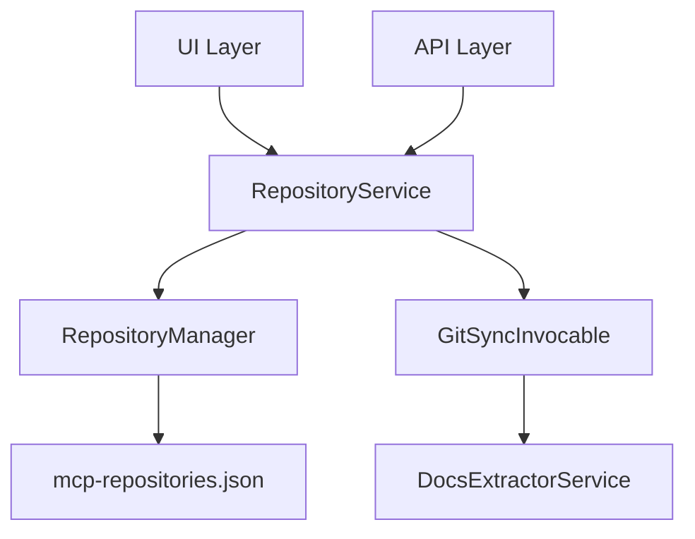

# Multi-Repository Implementation Plan

**Date:** 2026-03-09
**Status:** In Progress
**Approach:** JSON-based multi-repository system with mcp-repositories.json

---

## Architecture Overview



---

## File Structure

```
Services/
├── RepositoryManager.cs        # NEW - Manages mcp-repositories.json
├── RepositoryService.cs        # NEW - CRUD operations
├── Models/
│   ├── RepositoryInfo.cs       # NEW - Repository model
│   ├── SyncStatus.cs           # NEW - Enum
│   └── GitProvider.cs          # NEW - Enum

Components/
├── Pages/
│   ├── Index.razor            # UPDATE - Repository cards
│   └── Repositories.razor     # NEW - Repository management page
├── RepositoryCard.razor       # NEW - Card with view/edit toggle
```

---

## mcp-repositories.json Schema

```json
{
  "repositories": [
    {
      "id": "uuid-guid-here",
      "name": "BootstrapBlazor",
      "slug": "bootstrap-blazor",
      "url": "https://gitee.com/LongbowEnterprise/BootstrapBlazor.git",
      "provider": "Gitee",
      "localPath": "/app/data/BootstrapBlazorRepo",
      "outputDir": "/app/data/OutputRAG",
      "cronSchedule": "0 3 * * *",
      "isEnabled": true,
      "syncStatus": "NeverRun",
      "lastSyncAt": null,
      "lastSyncError": null,
      "createdAt": "2026-03-09T00:00:00Z",
      "updatedAt": "2026-03-09T00:00:00Z"
    }
  ]
}
```

---

## RepositoryInfo Model

```csharp
public class RepositoryInfo
{
    public string Id { get; set; }           // UUID
    public string Name { get; set; }         // Display name
    public string Slug { get; set; }         // URL-safe identifier
    public string Url { get; set; }          // Git repository URL
    public GitProvider Provider { get; set; } // GitHub, Gitee, GitLab
    public string LocalPath { get; set; }    // Clone directory
    public string OutputDir { get; set; }    // RAG output directory
    public string CronSchedule { get; set; } // Sync frequency
    public bool IsEnabled { get; set; }      // Enable/disable
    public SyncStatus SyncStatus { get; set; } // Current sync state
    public DateTime? LastSyncAt { get; set; } // Last sync time
    public string? LastSyncError { get; set; } // Last error message
    public DateTime CreatedAt { get; set; }
    public DateTime UpdatedAt { get; set; }
}

public enum GitProvider { GitHub, Gitee, GitLab, Other }
public enum SyncStatus { NeverRun, Running, Success, Failed }
```

---

## Implementation Steps

### Step 1: Create Models
- Create `RepositoryInfo.cs` with all properties
- Create `GitProvider.cs` enum
- Create `SyncStatus.cs` enum

### Step 2: Create RepositoryManager
- Load repositories from JSON
- Save repositories to JSON
- Add/Update/Delete operations
- File path: `data/mcp-repositories.json`

### Step 3: Update GitSyncInvocable
- Accept repository ID as parameter
- Load specific repository from RepositoryManager
- Update sync status during operation
- Handle errors and update status

### Step 4: Create RepositoryCard Component
- Display repository info in view mode
- Toggle button to switch to edit mode
- Edit mode shows configuration options:
  - Repository URL
  - Local path
  - Output directory
  - Cron schedule
  - Enable/disable toggle
  - Authentication fields

### Step 5: Update UI
- Update Index.razor to show repository cards
- Create Repositories.razor for full management
- Add sync triggers per repository

### Step 6: Add API Endpoints
- GET /api/repositories - List all
- GET /api/repositories/{id} - Get one
- POST /api/repositories - Add new
- PUT /api/repositories/{id} - Update
- DELETE /api/repositories/{id} - Delete
- POST /api/repositories/{id}/sync - Trigger sync

---

## Key Design Decisions

1. **JSON over SQLite**: Matches task requirement for mcp-repositories.json
2. **UUID for IDs**: Ensures unique identification across repositories
3. **Slug-based naming**: URL-friendly identifiers
4. **In-memory caching**: Repository data cached in service for performance
5. **File watching**: Optional file watcher for external JSON changes
